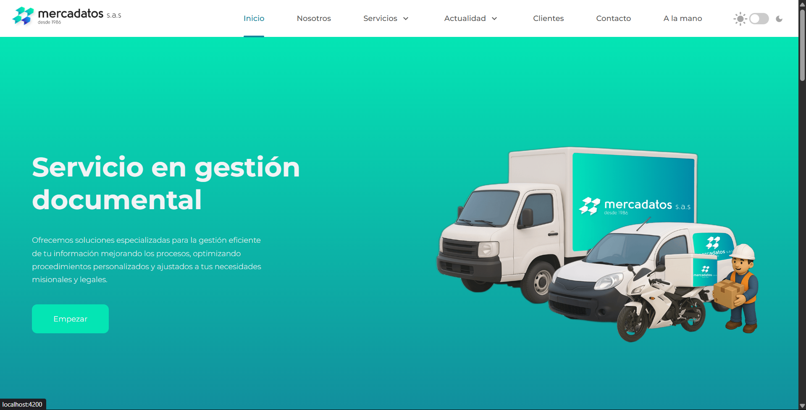
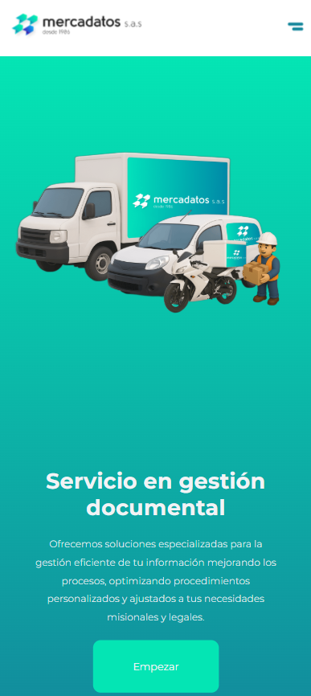

<p align="center">
  
</p>

<p align="center">
  <strong>Sitio web corporativo de Mercadatos S.A.S.</strong><br>
  Soluciones especializadas en gestion documental desde 1986.
</p>

<p align="center">
  
  
  
  
</p>

---

> **Nota:** Este proyecto se encuentra actualmente en desarrollo activo. Algunas funcionalidades pueden estar incompletas o sujetas a cambios.

## Vista previa

<p align="center">
  
</p>

<p align="center">
  
</p>

## Acerca del proyecto

Sitio web corporativo para **Mercadatos S.A.S.**, empresa colombiana con mas de 38 anos de experiencia en gestion documental, estudios de mercado e impresos graficos. El sitio presenta los servicios de la empresa, su trayectoria, clientes y canales de contacto.

### Secciones principales

- **Inicio** — Landing page con hero section animada y resumen de servicios
- **Nosotros** — Historia, mision, vision, timeline y equipo de trabajo
- **Servicios** — Catalogo detallado con rutas dinamicas por servicio
- **Clientes** — Portafolio de clientes y cobertura geografica
- **Actualidad** — Noticias y novedades (contenido en Markdown)
- **Contacto** — Formulario de contacto integrado con EmailJS

## Tecnologias

| Categoria | Tecnologia |
|-----------|-----------|
| Framework | Angular 19 (SSR con `@angular/ssr`) |
| Lenguaje | TypeScript 5.7 |
| Backend | Firebase (`@angular/fire`) |
| Mapas | MapLibre GL |
| Carruseles | Swiper |
| Contenido | Markdown (`marked`) |
| Email | EmailJS |
| Estilos | SCSS |

### Caracteristicas destacadas

- Server-Side Rendering (SSR) para SEO y rendimiento
- Tema claro / oscuro con persistencia
- Diseno responsive (mobile-first)
- Lazy loading de modulos
- Animaciones y transiciones fluidas
- Splash screen con loader global

## Inicio rapido

### Prerrequisitos

- [Node.js](https://nodejs.org/) (v18 o superior)
- [Angular CLI](https://angular.dev/tools/cli) v19

### Instalacion

```bash
# Clonar el repositorio
git clone https://github.com/tu-usuario/mercadatos.git
cd mercadatos

# Instalar dependencias
npm install
```

### Desarrollo

```bash
# Iniciar servidor de desarrollo
ng serve
```

Abrir [http://localhost:4200](http://localhost:4200) en el navegador. La aplicacion se recarga automaticamente al detectar cambios.

### Build de produccion

```bash
ng build
```

Los artefactos se generan en el directorio `dist/`.

### Servidor SSR

```bash
# Construir y servir con SSR
ng build && node dist/mercadatos/server/server.mjs
```

## Estructura del proyecto

```
src/
├── app/
│   ├── layout/             # Layout principal (navbar + footer + router)
│   ├── pages/              # Paginas (home, about, services, contact, etc.)
│   └── shared/
│       ├── components/     # Componentes reutilizables
│       └── services/       # Servicios (theme, utils, etc.)
└── assets/                 # Imagenes, videos y recursos estaticos
```

## Licencia

Proyecto privado. Todos los derechos reservados - Mercadatos S.A.S.
